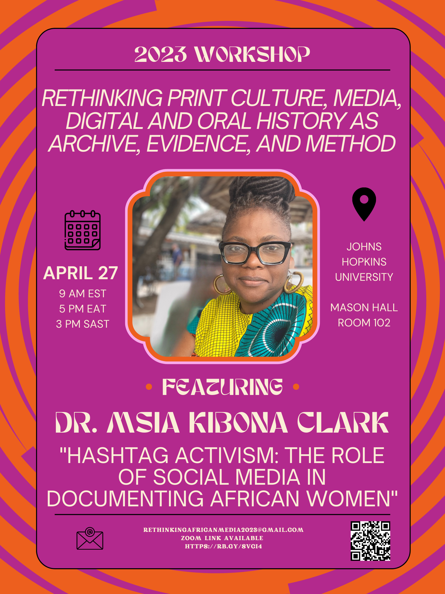

# Keynote: Rethinking Print Culture, Media, Digital and Oral History as Archive, Evidence, and Method

### Join us for a Keynote Address from Dr. Msia Kibona Clark.
{: style="center"}

### To receive the Zoom link, please RSVP [Here](https://docs.google.com/forms/d/e/1FAIpQLScelKAZUud_q_hu3fmhaBa_SfbmrJeFB8MeHyPwD88EqZ0tlA/viewform?usp=sf_link)

Dr. Msia Kibona Clark is an Associate Professor and Director of Graduate Studies in the Department of African Studies at Howard University in Washington, DC. Her work explores the role of cultural representations in presenting narratives that shape identities and perceptions around race, gender, and sexuality. Her work also explores African feminist activism and cyberactivism in digital and social media spaces. Her scholarship includes several articles, chapters, and books on Hip-Hop in Africa and African feminist engagement in hip hop and digital media spaces, including the books *Hip-Hop in Africa: Prophets of the City & Dustyfoot Philosophers*, *Hip Hop and Social Change in Africa: Ni Wakati*, *Pan African Spaces: Essays on Black Transnationalism*, and *African Women in Digital Spaces: Redefining Social Movements on the Continent and in the Diaspora*. She teaches the courses Black Women & Popular Culture and Hip Hop and Social Change in Africa. She is also the creator and host of the Hip Hop African Blog & Podcast. Additionally, she sits on the editorial boards of the Journal of African Cultural Studies and the Global Hip Hop Studies Journal.  

Personal website: [msiakibonaclark.com](https://msiakibonaclark.com)  
[Howard University profile](https://profiles.howard.edu/msia-clark)  
Twitter, Instagram, & Clubhouse @Kibona

